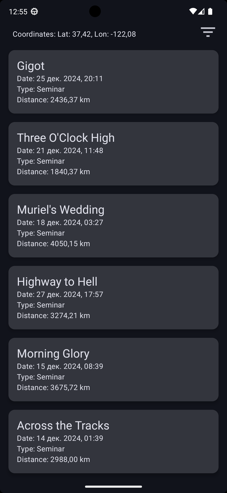
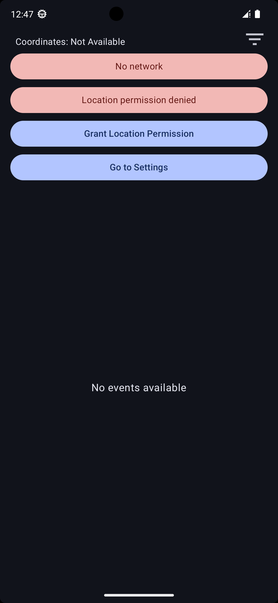
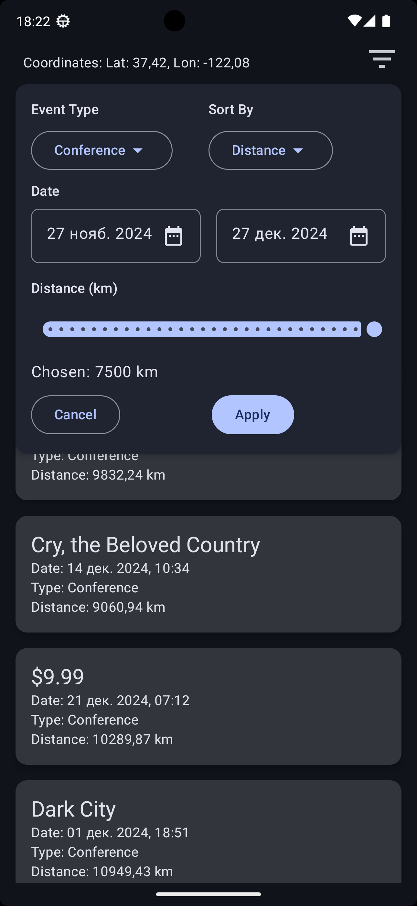

### GeoEventApp
**UI и навигация**: Jetpack Compose, Material 3, Compose Navigation.  
**DI**: Koin DI.  
**Сетевое взаимодействие**: Retrofit, Kotlin Serialization.  
**Локальное хранилище**: Room, Data Store.  
**Геолокация**: Location Google Play Services, Accompanist Permission.  
**Тестирование**: JUnit, Mockk.  
**Архитектура**: MVVM, DI, Clean Architecture  
**Техническое задание**: [TECHNICAL SPECIFICATIONS.md](https://github.com/vazh2100/GeoEventApplication/blob/master/TECHNICALSPECIFICATIONS.md)
 <div style="display: flex; justify-content: space-between;">    </div>

#### Экраны  
1. **Список событий**  
2. **Детальное отображение события**
   
#### Экран "Список событий"
-позволяет пользователю перейти на детальный экран события.  
-позволяет применить фильтр событий по типу, по начальной и/или конечной дате, по радиусу.  
-позволяет примениить сортировку по дате или расстоянию
-если координаты пользователя не доступны, то фильтр по радиусу недоступен и не применяется при фильтрации.
-если координаты пользователя не доступны, то сортировка по радиусу недоступна и не применяется
-если геолокация доступна, то отображает радиус событий.  
-позволяет пользователю отменить временные изменения фильтра по кнопке "Cancel" или сохранить изменения фильтра по кнопке "Apply".  
-отображает в реальном времени доступ в интернет.  
-отображает в реальном времени разрешение на отслеживание геолокации.  
-отображает в реальном времени включён ли GPS на устройстве.  
-отображает в реальном времени координаты пользователя.  
-предлагает предоставить разрешение на геолокацию или перейти в настройки приложения, если пользователь ранее отказал в предоставлении разрешения.  
-в процессе загрузки отображается индикатор загрузки.  
-если в процессе получения событий возникла ошибка, то ошибка отображается вместо списка с понятным для пользователя сообщением.  
-если список пуст, то отображается сообщение вместо списка.  

#### Экран "Детальное отображение события" 
-позволяет добавить событие в календарь с геометкой.  

#### Другие функции  
-сохраняет применённый фильтр и сортировку между сессиями работы приложения.  
-сохраняет последнюю дату, когда события были получены из интернета.  
-загружает новые события из сети, если прошло больше 30 минут с момента последней загрузки.  
-если нет сети, то события берутся из локального хранилища, независимо от валидности кэша.  

#### JSON с mock данными
Приложение использует файл [events.json](https://github.com/vazh2100/GeoEventApplication/blob/master/app/src/main/assets/events.json) для имитации API-ответа Retrofit c помощью [AssetInterceptor](https://github.com/vazh2100/GeoEventApplication/blob/master/app/src/main/java/com/vazh2100/geoeventapp/data/network/inteceptor/AssetInterceptor.kt).

```json
[
  {
    "id": 1,
    "name": "Wilde",
    "description": "Gonococcal endophthalmia",
    "type": "Festival",
    "latitude": 24.086481, 
    "longitude": 112.346259,
    "city": "Qiashui",  
    "date": "2024-12-06T13:55:07Z"
  }
]
```
#### Покрытие тестами
-написан Unit-тест, проверяющий фильтрацию событий в `EventsProcessor.kt`.  
-написан Unit-тест, проверяющий сортировку событий в `EventsProcessor.kt`.  
-написан Unit-тест, проверяющий расчёт расстояний между двумя геоточками в `GPoint.kt`.  


#### Дерево проекта
```css
./
   ├── data
   │   ├── network
   │   │   ├── api
   │   │   │   └── MainApi.kt
   │   │   ├── client
   │   │   │   └── MainClient.kt
   │   │   ├── inteceptor
   │   │   │   └── AssetInterceptor.kt
   │   ├── repository
   │   │   └── EventRepository.kt
   │   │   └── LocationRepository.kt
   │   │   └── NetworkStateRepository.kt
   │   ├── storages
   │   │   ├── device
   │   │   │   └── PreferencesStorage.kt
   │   │   ├── room
   │   │   │   ├── dao
   │   │   │   │   └── EventDao.kt
   │   │   │   ├── typeConverter
   │   │   │   │   └── DateConverter.kt
   │   │   │   │   └── EventTypeConverter.kt
   │   │   │   └── AppDataBase.kt
   │   │   │   └── DataBaseProvider.kt
   ├── domain
   │   ├── di
   │   │   └── Koin.kt
   │   ├── entities
   │   │   ├── event
   │   │   │   └── Event.kt
   │   │   │   └── EventSearchParams.kt
   │   │   │   └── EventSortType.kt
   │   │   │   └── EventsProcessor.kt
   │   │   │   └── EventType.kt
   │   │   ├── formatter
   │   │   │   └── DateFormatter.kt
   │   │   ├── json
   │   │   │   └── InstantDateTimeSerializer.kt
   │   │   └── AssetReader.kt
   │   │   └── GPoint.kt
   │   │   └── LocationStatus.kt
   │   │   └── NetworkStatus.kt
   │   ├── usecase
   │   │   └── GetFilteredEventsUseCase.kt
   │   │   └── GetLocationStatusUseCase.kt
   │   │   └── GetNetworkStatusUseCase.kt
   │   │   └── GetSavedFiltersUseCase.kt
   ├── presentaion
   │   ├── screen
   │   │   ├── eventDetail
   │   │   │   └── EventDetailScreen.kt
   │   │   ├── eventList
   │   │   │   ├── widget
   │   │   │   │   └── DateRangeSelector.kt
   │   │   │   │   └── ErrorPanel.kt
   │   │   │   │   └── EventListItem.kt
   │   │   │   │   └── EventList.kt
   │   │   │   │   └── EventTypeSelector.kt
   │   │   │   │   └── FilterPanel.kt
   │   │   │   │   └── LocationStatusBar.kt
   │   │   │   │   └── NetworkStatusBar.kt
   │   │   │   │   └── RadiusSelector.kt
   │   │   │   │   └── SortTypeSelector.kt
   │   │   │   └── EventListScreen.kt
   │   │   │   └── EventListViewModel.kt
   │   ├── theme
   │   │   └── Color.kt
   │   │   └── Theme.kt
   │   │   └── Type.kt
   │   └── Navigation.kt
   └── MainActivity.kt
   └── MyApp.kt
   └── tree.sh
```

